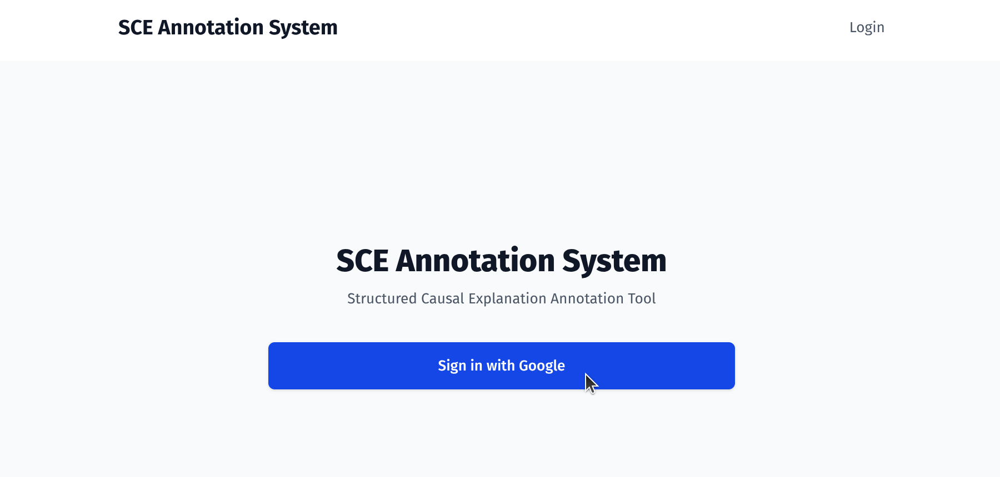
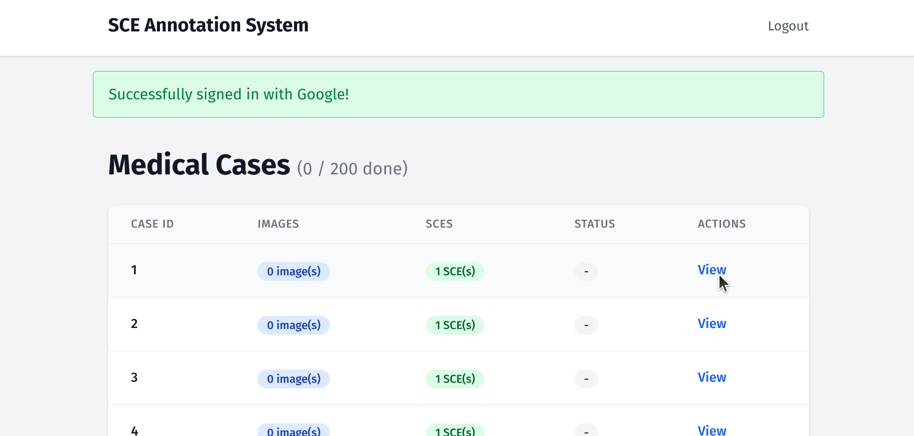
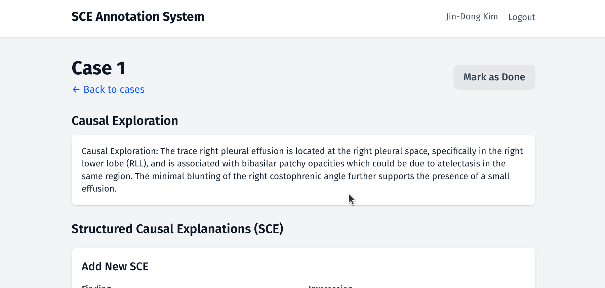
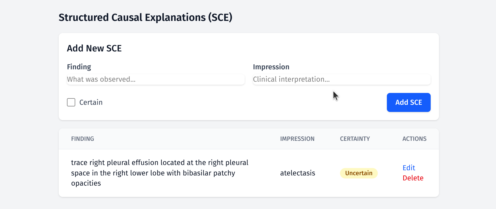
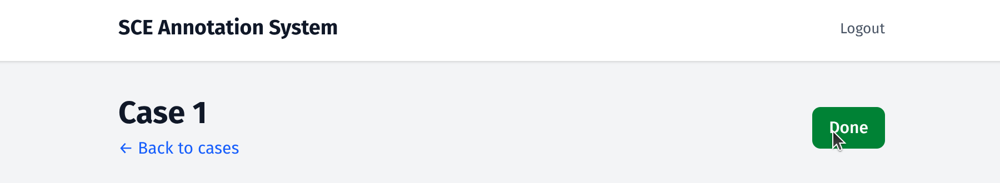

# アノテーター向け操作マニュアル

## 概要

SCEアノテーションシステムは、医用画像症例に対して**構造化因果説明（Structured Causal Explanation, SCE）**を付与するためのWebアプリケーションです。各SCEは以下の要素で構成されます：

- **Finding（所見）**：画像上で観察された放射線学的所見（画像で何が見えるか）
- **Impression（診断）**：臨床的な解釈（それが何を意味するか）
- **Certainty（確信度）**：因果関係に確信があるかどうか

あなたのタスクは、各症例を確認し、SCEアノテーションの検証・編集・追加を行うことです。

## はじめに

### 1. サインイン

Googleアカウントでサインインしてください。サインイン後、症例一覧ページに移動します。

### 2. 症例一覧

サインイン後、すべての医用画像症例の一覧が表示されます。テーブルには以下の情報が表示されます：

- **Case ID**：症例番号
- **Images**：利用可能な画像の枚数
- **SCEs**：その症例に対するあなたのSCEアノテーション数
- **Status**：その症例を「完了」としてマークしたかどうか
- **Actions**：「View」をクリックして症例を開く

見出しには全体の進捗状況が表示されます（例：「3 / 200 done」）。

任意の症例の **「View」** をクリックしてアノテーションを開始します。

## 症例のアノテーション

各症例の画面には、上から順に以下のセクションが表示されます：

### 3. 因果探索テキスト（Causal Exploration）

因果探索テキストを注意深く読んでください。このテキストは、放射線学的所見とその臨床的解釈の因果関係を記述しています。あなたのSCEアノテーションは、これらの因果関係を正確に捉える必要があります。

### 4. SCEアノテーション

ここがアノテーション作業の中心です。以下が表示されます：

- 上部に **新規SCE追加** フォーム
- 下部に **既存のSCE** テーブル（因果探索テキストから自動抽出された初期アノテーションが事前入力されています）

#### 既存SCEの確認

初期アノテーションは出発点として自動的に提供されています。各SCEについて以下を確認してください：

- **Finding（所見）** は観察された所見を正確に記述しているか？
- **Impression（診断）** は解釈を正しく述べているか？
- **Certainty（確信度）** は適切か？

#### SCEの編集

SCEの横にある **「Edit」** をクリックして、所見・診断・確信度を修正できます。

#### 新しいSCEの追加

初期アノテーションに含まれていない因果関係を見つけた場合：

1. **Finding**（画像上で観察された所見）を入力
2. **Impression**（臨床的な解釈）を入力
3. 因果関係に確信がある場合は **Certain** にチェック
4. **「Add SCE」** をクリック

#### SCEの削除

SCEが不正確または冗長な場合は、**「Delete」** をクリックして確認します。

### 5. 画像（Images）

症例の胸部X線画像を確認します。画像をクリックするとフルサイズで表示されます。**Escape** キーを押すか、画像の外側をクリックして閉じます。

### 6. 放射線科レポート（Radiology Report）

参考資料として、元の放射線科レポートが表示されます。

### 7. ABCDEチェックリスト

クリックして展開すると、ABCDE方式による胸部X線の体系的分析が表示されます。赤い **!** マークが付いた項目は異常所見を示しています。

## 症例の完了マーク

症例のすべてのSCEの確認・編集が完了したら、右上の **「Mark as Done」** ボタンをクリックしてください。ボタンが緑色に変わり、完了状態を示します。

変更が必要になった場合は、再度クリックして未完了に戻すことができます。

## ヒント

- まず **因果探索テキスト（Causal Exploration）** を読み、事前入力されたSCEと比較してください。
- **画像（Images）** と **放射線科レポート（Radiology Report）** を使って所見を確認してください。
- **ABCDEチェックリスト** で異常所見の網羅性を確認してください。
- 各Findingは **「何が見えるか」** を記述してください（例：「右肋骨横隔膜角の軽度鈍化」）。
- 各Impressionは **「それが何を意味するか」** を記述してください（例：「少量の胸水」）。
- Findingが Impressionを支持すると確信がある場合にのみ、Certaintyにチェックを入れてください。
- 各症例の作業完了時に **「Mark as Done」** をクリックすることを忘れないでください。

## スクリーンショットの追加

このドキュメントにスクリーンショットを追加するには、上記で参照されているファイル名（例：`01_login.png`、`02_case_list.png` など）でPNGファイルを `docs/screenshots/` フォルダに保存してください。
